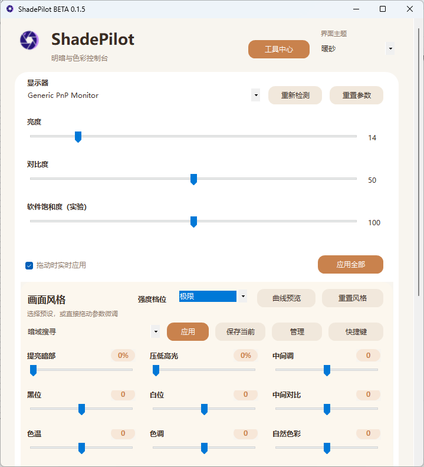
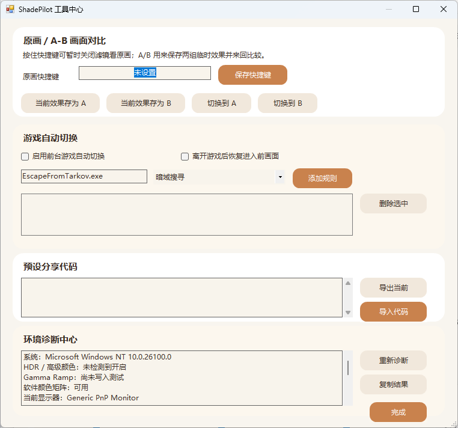
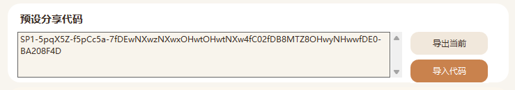

# ShadePilot

ShadePilot 是一款轻量的 Windows 显示体验调节工具。它把显示器硬件控制、画面风格和恢复操作集中到一个克制的桌面界面中，在达到明确功能目标后不继续堆叠无关能力。

> 当前版本：`BETA 0.1.5`（公开测试版）
> 平台：Windows 10/11

## 界面与效果

### 暗部提亮与高光压制


左上为原始画面，右下为 ShadePilot 极限参数的离线效果模拟。实际观感会受到显示器、HDR 状态、系统色彩设置和面板特性的影响。

### 主界面总览



显示器硬件参数与画面风格集中在同一界面，可调节亮度、对比度、软件饱和度、暗部、高光、中间调、黑白位、色温和自然色彩等项目。

### 工具中心与自动切换



工具中心包含按住查看原画、A/B 临时对比、前台游戏自动切换、预设分享代码和环境诊断。预设快捷键及多预设循环快捷键可在独立快捷键面板中配置，并可在后台使用。

### 预设分享代码



一串代码即可导出或导入完整画面预设，无需传递配置文件。

## 主要功能

- 枚举物理显示器，并检测亮度、对比度、色温及部分 DDC/CI 能力。
- 通过标准 Windows `Dxva2.dll` 接口调节支持的显示器。
- 提供有限的画面风格、Gamma 调节和自定义预设。
- 支持全局快捷键、系统托盘与按显示器保存的本地设置。
- 记录程序启动时的显示状态，可手动恢复，并默认在正常退出时恢复。

ShadePilot 不查找或读取游戏进程，不注入 DLL、不创建游戏覆盖层、不截图、不模拟输入，也不联网。它只调用 Windows 显示器配置 API。

## 安装与运行

1. 从 [Releases](https://github.com/BYS-XSQ/ShadePilot/releases) 下载 `ShadePilot-BETA-0.1.5-win-x64.zip`。
2. 完整解压后运行 `ShadePilot.exe`。
3. 如果未检测到显示器能力，请先在显示器菜单中启用 DDC/CI。

常规运行不需要管理员权限。测试版目前未进行商业代码签名，Windows 可能提示未知发布者；请只从本仓库 Release 下载并核对 SHA-256，不要永久关闭安全软件。

## 安全与恢复

- 应用启动时记录可读取的显示器参数和原始 Gamma 状态。
- “重置参数”和“重置风格”可分别恢复硬件参数与画面曲线。
- “退出时自动恢复”默认开启，正常关闭主窗口时执行恢复。
- 断电、系统崩溃或强制结束进程时，退出恢复无法保证执行；遇到显示异常时可重新运行 ShadePilot 并恢复，或使用显示器实体菜单恢复默认值。

## 兼容性与已知限制

- 外接显示器需要支持并启用 DDC/CI；内置屏幕、扩展坞、KVM 和部分转接器可能不支持。
- 不同厂商对 MCCS/VCP 指令的实现不一致，某些控件可能不可用或写入后不回报状态。
- Gamma 调节作用于整个 SDR 桌面，在 HDR 模式下可能无效或表现不同。
- 软件不会自动判断某套参数是否适合特定显示器，请小幅调节并保留恢复选项。

## 隐私

ShadePilot 不联网，不包含账号、遥测或广告 SDK。设置保存在 `%LOCALAPPDATA%\DisplayPresetPrototype\`，卸载时可以手动删除该目录。

## 从源码构建

```powershell
.\build.ps1
```

脚本使用 Windows 自带的 .NET Framework C# 编译器，不下载第三方依赖，输出为 `bin\ShadePilot.exe`。

## 反馈

Bug 报告请附上 ShadePilot 版本、Windows 版本、显示器型号、连接方式、DDC/CI 状态、复现步骤和错误提示。

- [报告问题](https://github.com/BYS-XSQ/ShadePilot/issues)
- [贡献指南](CONTRIBUTING.md)
- [安全问题报告](SECURITY.md)

## 许可证

源代码采用 [MIT License](LICENSE)。ShadePilot 名称、Logo、图标和品牌视觉素材不包含在 MIT 授权中，未经许可不得用于暗示官方版本或合作关系。

